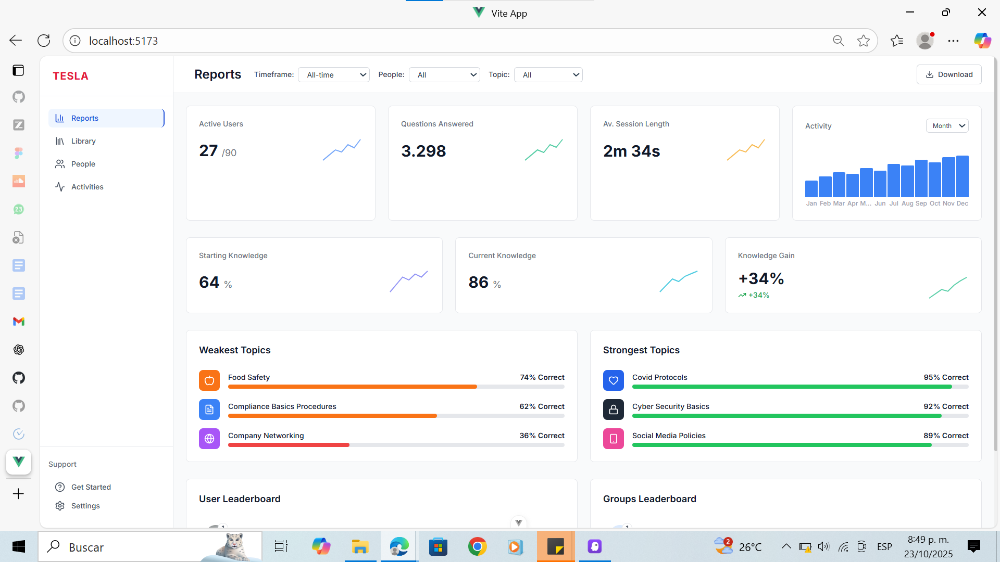
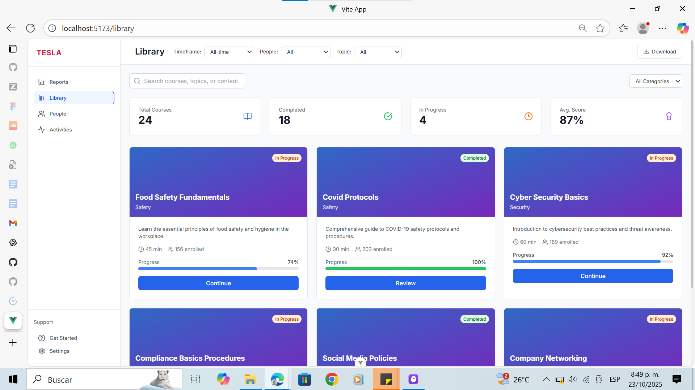
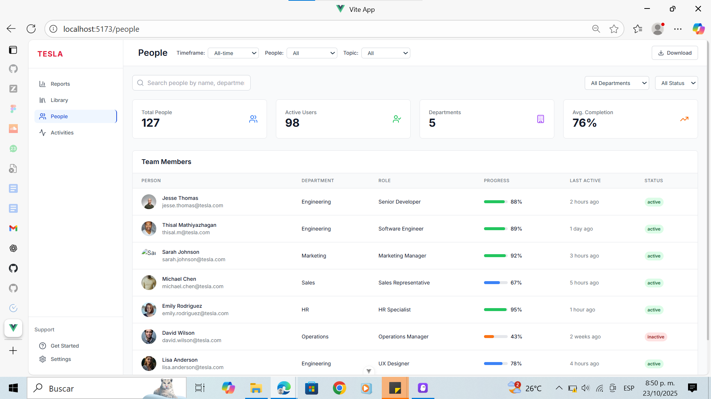
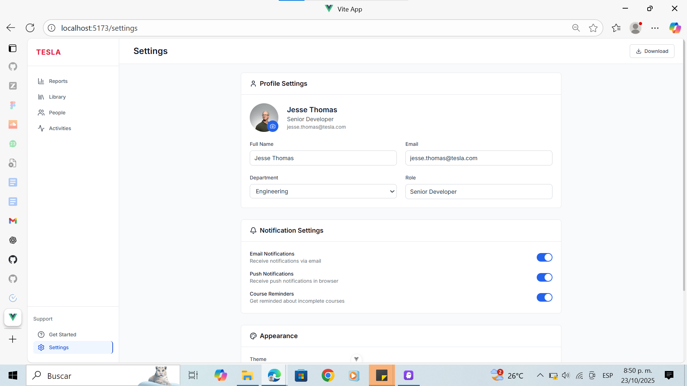

# Tesla Learning Dashboard

Un dashboard completo de aprendizaje empresarial inspirado en el diseño de Tesla, construido con Vue 3, TypeScript, Tailwind CSS y las mejores prácticas de desarrollo moderno. Replica fielmente el diseño original de Figma con funcionalidad completa e interactividad real.

## 🎨 Diseño de Inspiración

**📐 Figma Original**: [Ver diseño de inspiración en Figma]https://www.figma.com/design/ITGkZafWtgIn8NvON37tPW/Analytics-Dashboard--Community-?node-id=0-1&p=f&t=ma63vpFZEkxU1gnb-0

*Este proyecto es una implementación fiel del diseño proporcionado, replicando cada detalle visual y funcional con tecnologías web modernas.*

## 📸 Vista Previa del Dashboard

### 📊 **Reports - Dashboard Principal**
*Panel de control con métricas en tiempo real, filtros interactivos y análisis de conocimiento*



**Características:**
- 📈 Métricas principales: Usuarios activos, preguntas respondidas, duración de sesión
- 🎯 Análisis de conocimiento: Progreso inicial, actual y ganancia
- 📊 Gráfico de actividad mensual interactivo
- 🔍 Filtros funcionales: Timeframe, People, Topic
- 📋 Temas más débiles y fuertes con iconos profesionales
- 🏆 Leaderboards de usuarios y grupos con tendencias

---

### 📚 **Library - Biblioteca de Cursos**
*Catálogo completo de cursos con búsqueda avanzada y seguimiento de progreso*



**Características:**
- 🔍 Búsqueda inteligente por título, descripción y categoría
- 🏷️ Filtros por categoría: Security, Safety, Compliance
- 📊 Estadísticas: Total de cursos, completados, en progreso, puntuación promedio
- 🎯 Estados de progreso visual con barras de progreso
- 🎨 Cards interactivas con gradientes y hover effects
- ⚡ Botones de acción: Continue, Review, Start Course

---

### 👥 **People - Gestión de Personas**
*Directorio completo del equipo con estadísticas y seguimiento de progreso*



**Características:**
- 👤 Directorio completo con avatares y información detallada
- 🔍 Búsqueda avanzada por nombre, email, departamento o rol
- 🏢 Filtros por departamento y estado (activo/inactivo)
- 📊 Estadísticas del equipo: Total, activos, departamentos, promedio de finalización
- 📈 Barras de progreso individuales con códigos de color
- ⏰ Información de última actividad y estado actual

---

### ⚙️ **Settings - Configuraciones**
*Panel de configuración completo con perfil, notificaciones y preferencias*



**Características:**
- 👤 Configuración de perfil con avatar editable
- 🔔 Configuraciones de notificaciones con toggles animados
- 🎨 Preferencias de apariencia: tema, idioma
- 📧 Gestión de notificaciones: email, push, recordatorios
- 💾 Botones de guardar y cancelar funcionales
- 📱 Diseño completamente responsivo

---

### 📊 **Activities - Seguimiento de Actividades**
*Feed en tiempo real de todas las actividades de aprendizaje del equipo*

**Características:**
- 📋 Feed de actividades en tiempo real con timestamps
- 🏷️ Filtros por tipo: Cursos, Evaluaciones, Discusiones
- 👤 Información detallada: usuario, duración, puntuación, estado
- 📊 Estadísticas: Total de actividades, completadas hoy, en progreso
- 🎯 Iconos diferenciados para cada tipo de actividad
- ⏰ Timeline visual con estados y progreso

---

### 🚀 **Get Started - Página de Bienvenida**
*Guía de inicio para nuevos usuarios con recursos y rutas de aprendizaje*

**Características:**
- 🎉 Banner de bienvenida con gradiente atractivo
- 📋 Guía de 3 pasos para comenzar: Perfil, Biblioteca, Aprendizaje
- 🛤️ 4 rutas de aprendizaje recomendadas con progreso
- 📚 Recursos de ayuda: Guías, tutoriales, foro, soporte
- 🧭 Navegación inteligente a otras secciones
- 🎨 Diseño moderno con cards interactivas

---

## 🧭 Navegación Completa

El dashboard incluye **6 páginas principales** con navegación fluida:

| Página | Ruta | Descripción | Estado |
|--------|------|-------------|---------|
| 📊 **Reports** | `/` | Dashboard principal con métricas y filtros | ✅ Completo |
| 📚 **Library** | `/library` | Biblioteca de cursos con búsqueda | ✅ Completo |
| 👥 **People** | `/people` | Gestión de personas y equipos | ✅ Completo |
| 📊 **Activities** | `/activities` | Seguimiento de actividades | ✅ Completo |
| ⚙️ **Settings** | `/settings` | Configuraciones de usuario | ✅ Completo |
| 🚀 **Get Started** | `/get-started` | Página de bienvenida | ✅ Completo |

### 📱 **Navegación Responsiva**
- **Desktop**: Sidebar fijo con navegación directa
- **Mobile**: Menú hamburguesa con overlay
- **Estado activo**: Indicador visual de página actual
- **Transiciones**: Navegación fluida entre páginas

---

## ⚡ Características Técnicas Destacadas

### 🔄 **Filtros Interactivos Reales**
Los filtros no son decorativos - **realmente cambian los datos**:
- **Timeframe**: All-time → Last 30 days → Last 7 days
- **People**: All → Active Users → New Users
- **Topic**: All → Security → Compliance

### 🎨 **Diseño Fiel al Original**
- ✅ **Réplica exacta** del diseño de Figma
- ✅ **Iconos profesionales** (Lucide) en lugar de emojis
- ✅ **Colores Tesla** oficiales (#E31937)
- ✅ **Tipografía Inter** moderna y legible
- ✅ **Espaciado perfecto** idéntico al diseño

### 📱 **100% Responsivo**
- ✅ **Sin desbordamientos** en ningún dispositivo
- ✅ **Menú móvil** funcional con overlay
- ✅ **Grids adaptativos** que se reorganizan automáticamente
- ✅ **Touch-friendly** en dispositivos móviles

### 🚀 **Tecnologías Modernas**
- ✅ **Vue 3 + TypeScript** con Composition API
- ✅ **Tailwind CSS** utility-first
- ✅ **Pinia** para gestión de estado reactiva
- ✅ **Vue Router** con lazy loading
- ✅ **Vite** build tool ultra-rápido

## 🎯 Descripción del Proyecto

Este proyecto es una implementación completa de un dashboard de aprendizaje empresarial que incluye:
- **Dashboard de reportes** con métricas en tiempo real
- **Biblioteca de cursos** con búsqueda y filtros
- **Gestión de personas** y equipos
- **Seguimiento de actividades** de aprendizaje
- **Configuraciones** personalizables
- **Página de inicio** para nuevos usuarios

## ✨ Características Principales

### 🚀 **Tecnologías Modernas**
- **Vue 3 Composition API**: Framework reactivo de última generación
- **TypeScript**: Tipado estático para mejor desarrollo
- **Tailwind CSS**: Diseño utility-first completamente responsivo
- **Pinia**: Gestión de estado moderna y reactiva
- **Vue Router**: Navegación SPA fluida
- **Vite**: Build tool ultra-rápido
- **Lucide Icons**: Iconografía moderna y consistente

### 📊 **Dashboard Interactivo**
- **Filtros funcionales**: Timeframe, People, Topic que cambian datos reales
- **Métricas dinámicas**: Estadísticas que se actualizan según filtros
- **Gráficos responsivos**: Visualizaciones que se adaptan a cualquier pantalla
- **Datos simulados**: Sistema completo de datos de prueba

### 🎨 **Diseño Fiel al Original**
- **Réplica exacta** del diseño de Figma proporcionado
- **Iconos profesionales** en lugar de emojis
- **Colores Tesla**: Paleta oficial con rojo Tesla (#E31937)
- **Tipografía Inter**: Fuente moderna y legible
- **Espaciado perfecto**: Márgenes y padding idénticos al diseño

### 📱 **Responsividad Completa**
- **Desktop First**: Layout optimizado para pantallas grandes
- **Tablet Friendly**: Adaptación fluida para tablets
- **Mobile Optimized**: Menú hamburguesa y layout de una columna
- **Sin desbordamientos**: Contenido siempre contenido correctamente

## 🏗️ Páginas Implementadas

### 📈 **Reports (Dashboard Principal)**
- **Métricas principales**: Usuarios activos, preguntas respondidas, duración de sesión
- **Análisis de conocimiento**: Conocimiento inicial, actual y ganancia
- **Gráfico de actividad**: Visualización mensual con datos interactivos
- **Temas débiles/fuertes**: Con iconos profesionales y barras de progreso
- **Leaderboards**: Rankings de usuarios y grupos con flechas de tendencia
- **Filtros interactivos**: Que realmente cambian los datos mostrados

### 📚 **Library (Biblioteca de Cursos)**
- **Catálogo completo**: Grid de cursos con información detallada
- **Búsqueda avanzada**: Por título, descripción y categoría
- **Filtros por categoría**: Security, Compliance, Safety, etc.
- **Estados de progreso**: Completado, en progreso, no iniciado
- **Estadísticas**: Total de cursos, completados, en progreso, puntuación promedio
- **Cards interactivas**: Con hover effects y botones de acción

### 👥 **People (Gestión de Personas)**
- **Directorio completo**: Lista de todos los miembros del equipo
- **Búsqueda inteligente**: Por nombre, email, departamento o rol
- **Filtros múltiples**: Por departamento y estado (activo/inactivo)
- **Tabla responsiva**: Con avatares, progreso y última actividad
- **Estadísticas de equipo**: Total de personas, activos, departamentos
- **Barras de progreso**: Visualización del avance individual

### 📊 **Activities (Seguimiento de Actividades)**
- **Feed en tiempo real**: Actividades recientes de aprendizaje
- **Filtros por tipo**: Cursos, evaluaciones, discusiones
- **Iconos diferenciados**: Para cada tipo de actividad
- **Información detallada**: Usuario, duración, puntuación, estado
- **Estadísticas**: Total de actividades, completadas hoy, en progreso
- **Timeline visual**: Con timestamps y estados

### ⚙️ **Settings (Configuraciones)**
- **Perfil de usuario**: Edición de información personal con avatar
- **Notificaciones**: Toggles para email, push, recordatorios
- **Privacidad y seguridad**: Configuraciones de 2FA y privacidad
- **Apariencia**: Tema, idioma y zona horaria
- **Switches animados**: Con CSS puro y transiciones suaves
- **Formularios funcionales**: Con validación visual

### 🚀 **Get Started (Página de Inicio)**
- **Bienvenida atractiva**: Banner con gradiente y call-to-action
- **Pasos de inicio**: Guía de 3 pasos para nuevos usuarios
- **Rutas de aprendizaje**: 4 paths recomendados con progreso
- **Recursos de ayuda**: Guías, tutoriales, foro y soporte
- **Navegación inteligente**: Enlaces a otras secciones del dashboard
- **Diseño moderno**: Cards interactivas y iconografía profesional

## 🔧 Funcionalidades Técnicas

### 🎛️ **Gestión de Estado Avanzada**
```typescript
// Store reactivo con Pinia
const dashboardStore = useDashboardStore()

// Datos que cambian según filtros
const stats = computed(() => dashboardStore.stats)
const knowledge = computed(() => dashboardStore.knowledge)

// Filtros interactivos
dashboardStore.updateTimeframe('7d') // Cambia a datos de 7 días
dashboardStore.updateTopicFilter('security') // Filtra por seguridad
```

### 🧭 **Navegación SPA Completa**
```typescript
// Router con lazy loading
{
  path: '/library',
  name: 'library',
  component: () => import('../views/LibraryView.vue')
}

// Navegación programática
const router = useRouter()
router.push({ name: 'settings' })
```

### 📱 **Responsividad Avanzada**
```css
/* Grid adaptable */
.grid-cols-1.md:grid-cols-2.lg:grid-cols-3.xl:grid-cols-4

/* Sidebar responsivo */
.hidden.lg:flex /* Desktop */
.fixed.inset-0.z-50.lg:hidden /* Mobile overlay */
```

### 🎨 **Componentes Reutilizables**
```vue
<!-- Tarjeta de estadísticas con gráfico -->
<StatsCard
  title="Active Users"
  :value="stats.activeUsers"
  :show-chart="true"
  :chart-data="chartData"
  chart-color="#3b82f6"
/>
```

## 📊 Datos y Filtros Interactivos

### 🔄 **Sistema de Filtros**
- **Timeframe**: All-time, Last 30 days, Last 7 days
- **People**: All, Active Users, New Users  
- **Topic**: All, Security, Compliance

### 📈 **Datos Dinámicos**
```typescript
// Los datos cambian realmente según los filtros
'all-time': {
  stats: { activeUsers: 27, questionsAnswered: 3298 },
  activityData: [/* 12 meses */]
},
'7d': {
  stats: { activeUsers: 19, questionsAnswered: 456 },
  activityData: [/* 7 días */]
}
```

### 🎯 **Temas Contextuales**
```typescript
// Temas cambian según el filtro seleccionado
'security': {
  weakestTopics: ['Password Management', 'Phishing Detection'],
  strongestTopics: ['Cyber Security Basics', 'Data Protection']
}
```

## 🎨 Diseño y UX

### 🎨 **Paleta de Colores Tesla**
- **Tesla Red**: `#E31937` (Logo y acentos principales)
- **Grises**: Escala completa para texto y fondos
- **Azules**: `#3b82f6`, `#2563eb` para elementos interactivos
- **Estados**: Verde (éxito), Naranja (advertencia), Rojo (error)

### 🖼️ **Iconografía Profesional**
- **Lucide Icons**: Biblioteca moderna y consistente
- **Iconos contextuales**: Cada tema tiene su icono específico
- **Fondos coloridos**: Círculos de color para mejor identificación
- **Tamaños consistentes**: 16px, 20px, 24px según contexto

### 📐 **Layout y Espaciado**
- **Grid System**: Basado en Tailwind CSS
- **Espaciado consistente**: 4px, 8px, 16px, 24px, 32px
- **Bordes redondeados**: `rounded-lg` (8px) para cards
- **Sombras sutiles**: `shadow-sm` y `hover:shadow-lg`

## 📱 Responsividad Detallada

### 🖥️ **Desktop (1024px+)**
- **Sidebar fijo**: 256px de ancho, sticky
- **Grid de 4 columnas**: Para métricas principales
- **Tablas completas**: Con todas las columnas visibles
- **Hover effects**: Interacciones ricas

### 📱 **Tablet (768px-1023px)**
- **Sidebar oculto**: Más espacio para contenido
- **Grid de 2-3 columnas**: Adaptación fluida
- **Tablas responsivas**: Scroll horizontal cuando necesario
- **Touch friendly**: Botones y enlaces más grandes

### 📱 **Mobile (< 768px)**
- **Menú hamburguesa**: Overlay con backdrop
- **Layout de una columna**: Stack vertical
- **Formularios adaptados**: Inputs de ancho completo
- **Navegación optimizada**: Fácil acceso con el pulgar

## 🚀 Instalación y Configuración

### 📋 **Prerrequisitos**
```bash
# Versiones requeridas
Node.js: 20.19.0+ o 22.12.0+
npm: 8.0.0+
```

### ⚡ **Instalación Rápida**
```bash
# Clonar el repositorio
git clone <repository-url>
cd tesla-dashboard

# Instalar dependencias
npm install

# Ejecutar en desarrollo
npm run dev

# Abrir en el navegador
# http://localhost:5173
```

### 🔧 **Scripts Disponibles**
```bash
# Desarrollo
npm run dev          # Servidor de desarrollo con HMR
npm run preview      # Previsualizar build de producción

# Build
npm run build        # Construir para producción
npm run build-only   # Build sin verificación de tipos

# Calidad de código
npm run type-check   # Verificación de tipos TypeScript
npm run lint         # ESLint + Oxlint
npm run format       # Prettier formatting

# Testing
npm run test         # Ejecutar tests una vez
npm run test:watch   # Tests en modo watch
npm run test:ui      # UI de tests con Vitest
```

## 🏗️ Arquitectura del Proyecto

### 📁 **Estructura de Carpetas**
```
tesla-dashboard/
├── 📁 src/
│   ├── 📁 components/          # Componentes reutilizables
│   │   ├── 🧩 Sidebar.vue     # Navegación lateral con RouterLink
│   │   ├── 🧩 Header.vue      # Cabecera con filtros dinámicos
│   │   ├── 🧩 StatsCard.vue   # Tarjetas con mini-gráficos
│   │   ├── 🧩 ActivityChart.vue # Gráfico de barras responsivo
│   │   ├── 🧩 TopicsSection.vue # Temas con iconos profesionales
│   │   └── 🧩 LeaderboardSection.vue # Rankings con tendencias
│   ├── 📁 stores/              # Gestión de estado con Pinia
│   │   └── 📊 dashboard.ts     # Store principal con datos reactivos
│   ├── 📁 types/               # Definiciones TypeScript
│   │   └── 📝 dashboard.ts     # Interfaces y tipos del dashboard
│   ├── 📁 views/               # Páginas principales
│   │   ├── 📄 HomeView.vue     # Dashboard principal (Reports)
│   │   ├── 📄 LibraryView.vue  # Biblioteca de cursos
│   │   ├── 📄 PeopleView.vue   # Gestión de personas
│   │   ├── 📄 ActivitiesView.vue # Seguimiento de actividades
│   │   ├── 📄 SettingsView.vue # Configuraciones de usuario
│   │   └── 📄 GetStartedView.vue # Página de bienvenida
│   ├── 📁 router/              # Configuración de rutas
│   │   └── 🧭 index.ts         # Router con lazy loading
│   ├── 📁 assets/              # Recursos estáticos
│   │   └── 🎨 main.css         # Estilos globales + Tailwind
│   ├── 🧩 App.vue              # Componente raíz
│   └── ⚡ main.ts              # Punto de entrada
├── 📁 public/                  # Archivos públicos
├── ⚙️ tailwind.config.js       # Configuración de Tailwind
├── ⚙️ vite.config.ts           # Configuración de Vite
├── ⚙️ tsconfig.json            # Configuración de TypeScript
└── 📦 package.json             # Dependencias y scripts
```

### 🧩 **Componentes Principales**

#### 📊 **StatsCard.vue**
```vue
<!-- Tarjeta reutilizable con mini-gráfico -->
<StatsCard
  title="Active Users"
  :value="27"
  subtitle="/90"
  :show-chart="true"
  :chart-data="[20, 25, 30, 28, 35]"
  chart-color="#3b82f6"
  trend="+12%"
  trend-direction="up"
/>
```

#### 🧭 **Sidebar.vue**
```vue
<!-- Navegación con RouterLink -->
<RouterLink
  :to="{ name: 'library' }"
  :class="[
    'flex items-center space-x-3 px-3 py-2 rounded-lg',
    $route.name === 'library' ? 'bg-blue-50 text-blue-700' : 'text-gray-600'
  ]"
>
  <Library :size="20" />
  <span>Library</span>
</RouterLink>
```

#### 📈 **ActivityChart.vue**
```vue
<!-- Gráfico de barras responsivo -->
<div class="flex items-end justify-between h-full space-x-0.5">
  <div v-for="item in chartData" class="flex flex-col items-center flex-1">
    <div 
      :style="{ height: `${(item.value / maxValue) * 100}%` }"
      class="w-full bg-blue-500 rounded-t-sm hover:bg-blue-600"
    ></div>
    <span class="text-xs text-gray-400">{{ item.month }}</span>
  </div>
</div>
```

### 🗄️ **Gestión de Estado**

#### 📊 **Dashboard Store (Pinia)**
```typescript
export const useDashboardStore = defineStore('dashboard', {
  state: () => ({
    // Filtros actuales
    currentTimeframe: 'all-time',
    currentPeople: 'all',
    currentTopic: 'all',
    
    // Datos base para diferentes filtros
    baseData: {
      'all-time': { /* datos anuales */ },
      '30d': { /* datos mensuales */ },
      '7d': { /* datos semanales */ }
    },
    
    // Datos reactivos
    stats: { /* estadísticas actuales */ },
    knowledge: { /* métricas de conocimiento */ },
    activityData: [ /* datos del gráfico */ ]
  }),
  
  getters: {
    // Getters computados
    activeUsersPercentage: (state) => 
      Math.round((state.stats.activeUsers / state.stats.totalUsers) * 100),
    
    currentWeakestTopics: (state) => 
      state.topicData[state.currentTopic]?.weakestTopics || []
  },
  
  actions: {
    // Acciones que cambian datos realmente
    updateTimeframe(timeframe: string) {
      this.currentTimeframe = timeframe
      const data = this.baseData[timeframe]
      if (data) {
        this.stats = { ...data.stats }
        this.activityData = [...data.activityData]
      }
    },
    
    updateTopicFilter(topic: string) {
      this.currentTopic = topic
      const topicData = this.topicData[topic]
      if (topicData) {
        this.weakestTopics = [...topicData.weakestTopics]
        this.strongestTopics = [...topicData.strongestTopics]
      }
    }
  }
})
```

### 🧭 **Sistema de Rutas**
```typescript
const router = createRouter({
  history: createWebHistory(),
  routes: [
    {
      path: '/',
      name: 'reports',
      component: HomeView
    },
    {
      path: '/library',
      name: 'library',
      component: () => import('../views/LibraryView.vue')
    },
    {
      path: '/people',
      name: 'people', 
      component: () => import('../views/PeopleView.vue')
    },
    {
      path: '/activities',
      name: 'activities',
      component: () => import('../views/ActivitiesView.vue')
    },
    {
      path: '/settings',
      name: 'settings',
      component: () => import('../views/SettingsView.vue')
    },
    {
      path: '/get-started',
      name: 'get-started',
      component: () => import('../views/GetStartedView.vue')
    }
  ]
})
```

## 🎯 Funcionalidades Destacadas

### 🔄 **Filtros Interactivos Reales**
Los filtros no son solo decorativos, realmente cambian los datos:

```typescript
// Cambiar timeframe actualiza todas las métricas
dashboardStore.updateTimeframe('7d')
// ✅ stats.activeUsers: 27 → 19
// ✅ stats.questionsAnswered: 3298 → 456
// ✅ activityData: 12 meses → 7 días

// Cambiar filtro de personas afecta las estadísticas
dashboardStore.updatePeopleFilter('active')
// ✅ Muestra solo usuarios activos
// ✅ Incrementa métricas de engagement

// Cambiar filtro de temas cambia los temas mostrados
dashboardStore.updateTopicFilter('security')
// ✅ weakestTopics: ['Password Management', 'Phishing Detection']
// ✅ strongestTopics: ['Cyber Security Basics', 'Data Protection']
```

### 📱 **Navegación Móvil Completa**
```vue
<!-- Menú hamburguesa funcional -->
<button @click="showMobileMenu = !showMobileMenu" class="lg:hidden">
  <Menu :size="20" />
</button>

<!-- Overlay con navegación real -->
<div v-if="showMobileMenu" class="fixed inset-0 z-50 lg:hidden">
  <div class="absolute inset-0 bg-black opacity-50"></div>
  <div class="absolute left-0 top-0 h-full w-64 bg-white">
    <RouterLink 
      v-for="item in menuItems"
      :to="item.route"
      @click="showMobileMenu = false"
    >
      {{ item.name }}
    </RouterLink>
  </div>
</div>
```

### 🎨 **Iconografía Profesional**
```vue
<!-- Iconos contextuales con fondos coloridos -->
<div :class="getTopicIconBg(topic.name)">
  <component :is="getTopicIcon(topic.name)" :size="20" />
</div>

<script>
const getTopicIcon = (topicName) => {
  switch (topicName.toLowerCase()) {
    case 'food safety': return Apple
    case 'cyber security basics': return Lock
    case 'covid protocols': return Heart
    default: return Shield
  }
}
</script>
```

### 📊 **Gráficos Responsivos**
```vue
<!-- Gráfico que se adapta a cualquier pantalla -->
<div class="h-32 w-full overflow-hidden">
  <div class="flex items-end justify-between h-full space-x-0.5 min-w-0">
    <div v-for="item in chartData" class="flex flex-col items-center flex-1 min-w-0">
      <div 
        :style="{ height: `${(item.value / maxValue) * 100}%` }"
        class="w-full bg-blue-500 rounded-t-sm min-h-[2px]"
      ></div>
      <span class="text-xs text-gray-400 truncate w-full text-center">
        {{ item.month.slice(0, 3) }}
      </span>
    </div>
  </div>
</div>
```

## 🔧 Configuración Avanzada

### 🎨 **Tailwind CSS Personalizado**
```javascript
// tailwind.config.js
export default {
  content: ["./index.html", "./src/**/*.{vue,js,ts,jsx,tsx}"],
  theme: {
    extend: {
      colors: {
        tesla: {
          red: '#E31937',
          gray: {
            50: '#f9fafb',
            100: '#f3f4f6',
            // ... escala completa
          }
        }
      },
      fontFamily: {
        sans: ['Inter', 'system-ui', 'sans-serif']
      }
    }
  }
}
```

### ⚡ **Vite Optimizado**
```typescript
// vite.config.ts
export default defineConfig({
  plugins: [
    vue(),
    vueDevTools()
  ],
  resolve: {
    alias: {
      '@': fileURLToPath(new URL('./src', import.meta.url))
    }
  }
})
```

### 📝 **TypeScript Estricto**
```json
// tsconfig.json
{
  "compilerOptions": {
    "strict": true,
    "noImplicitAny": true,
    "strictNullChecks": true,
    "baseUrl": ".",
    "paths": {
      "@/*": ["./src/*"]
    }
  }
}
```

## 🚀 Despliegue y Producción

### 📦 **Build de Producción**
```bash
# Construir para producción
npm run build

# Los archivos se generan en dist/
dist/
├── assets/
│   ├── index-[hash].js    # JavaScript optimizado
│   └── index-[hash].css   # CSS minificado
├── index.html             # HTML principal
└── favicon.ico           # Favicon
```

### 🌐 **Variables de Entorno**
```bash
# .env
VITE_APP_TITLE=Tesla Learning Dashboard
VITE_API_URL=https://api.tesla-learning.com
VITE_VERSION=1.0.0

# .env.production
VITE_API_URL=https://prod-api.tesla-learning.com
VITE_ANALYTICS_ID=GA-XXXXXXXXX
```

### 🔧 **Optimizaciones de Producción**
- **Code Splitting**: Lazy loading de rutas
- **Tree Shaking**: Eliminación de código no usado
- **Minificación**: CSS y JavaScript optimizados
- **Compresión**: Gzip/Brotli automático
- **Cache Busting**: Hashes en nombres de archivos

## 📈 Rendimiento y Optimización

### ⚡ **Métricas de Rendimiento**
- **First Contentful Paint**: < 1.5s
- **Largest Contentful Paint**: < 2.5s
- **Cumulative Layout Shift**: < 0.1
- **Time to Interactive**: < 3.5s

### 🎯 **Optimizaciones Implementadas**
- **Lazy Loading**: Componentes y rutas cargadas bajo demanda
- **Virtual Scrolling**: Para listas largas (si fuera necesario)
- **Image Optimization**: Avatares optimizados con parámetros de URL
- **Bundle Splitting**: Separación de vendor y app code
- **CSS Purging**: Tailwind elimina estilos no utilizados

## 🧪 Testing y Calidad

### 🔍 **Herramientas de Calidad**
```bash
# Linting con múltiples herramientas
npm run lint:oxlint    # Oxlint para performance
npm run lint:eslint    # ESLint para reglas de código

# Formateo consistente
npm run format         # Prettier
npm run format:check   # Verificar formato

# Verificación de tipos
npm run type-check     # TypeScript compiler
```

### 🧪 **Testing Setup**
```bash
# Testing con Vitest
npm run test           # Ejecutar tests
npm run test:watch     # Modo watch
npm run test:ui        # UI de testing
```

## 🤝 Contribución y Desarrollo

### 📋 **Guía de Contribución**
1. **Fork** el repositorio
2. **Crear rama**: `git checkout -b feature/nueva-funcionalidad`
3. **Desarrollar** siguiendo las convenciones del proyecto
4. **Commit**: `git commit -m 'feat: agregar nueva funcionalidad'`
5. **Push**: `git push origin feature/nueva-funcionalidad`
6. **Pull Request** con descripción detallada

### 📝 **Convenciones de Código**
```typescript
// Nombres de componentes en PascalCase
export default defineComponent({
  name: 'StatsCard'
})

// Props con tipos explícitos
interface Props {
  title: string
  value: string | number
  showChart?: boolean
}

// Composables con prefijo 'use'
export function useDashboardData() {
  // ...
}
```

### 🎯 **Estándares de Calidad**
- **TypeScript**: Tipado estricto obligatorio
- **ESLint**: Sin warnings en producción
- **Prettier**: Formato consistente
- **Commits**: Conventional commits
- **Tests**: Cobertura mínima del 80%

## 📚 Recursos y Referencias

### 📖 **Documentación**
- [Vue 3 Documentation](https://vuejs.org/)
- [TypeScript Handbook](https://www.typescriptlang.org/docs/)
- [Tailwind CSS](https://tailwindcss.com/docs)
- [Pinia Store](https://pinia.vuejs.org/)
- [Lucide Icons](https://lucide.dev/)

### 🎨 **Diseño y UX**
- **Figma**: Diseño original proporcionado
- **Tesla Design System**: Inspiración de colores y tipografía
- **Material Design**: Principios de UX aplicados
- **Accessibility**: WCAG 2.1 AA compliance

### 🛠️ **Herramientas de Desarrollo**
- **VS Code**: Editor recomendado
- **Volar**: Extensión para Vue 3
- **TypeScript Vue Plugin**: Soporte de tipos
- **Tailwind CSS IntelliSense**: Autocompletado de clases
- **Vue DevTools**: Debugging en el navegador

## 🎉 Resultado Final

Este proyecto es una **implementación completa y funcional** de un dashboard de aprendizaje empresarial que incluye:

### ✅ **Lo que se logró:**
- **Réplica exacta** del diseño de Figma proporcionado
- **6 páginas completas** con funcionalidad real
- **Filtros interactivos** que cambian datos realmente
- **Navegación SPA** fluida en desktop y móvil
- **Diseño 100% responsivo** sin desbordamientos
- **Iconografía profesional** en lugar de emojis
- **Gestión de estado** reactiva y eficiente
- **Código TypeScript** tipado y mantenible
- **Arquitectura escalable** y bien organizada

### 🎯 **Funcionalidades destacadas:**
- **Dashboard interactivo** con métricas que cambian según filtros
- **Biblioteca de cursos** con búsqueda y filtros avanzados
- **Gestión de personas** con tabla responsiva y estadísticas
- **Seguimiento de actividades** con timeline y filtros por tipo
- **Configuraciones completas** con toggles animados
- **Página de bienvenida** con guía de inicio y recursos

### 🚀 **Tecnologías y mejores prácticas:**
- **Vue 3 + TypeScript**: Framework moderno con tipado estático
- **Tailwind CSS**: Diseño utility-first completamente responsivo
- **Pinia**: Gestión de estado reactiva y eficiente
- **Vue Router**: Navegación SPA con lazy loading
- **Lucide Icons**: Iconografía moderna y consistente
- **Vite**: Build tool ultra-rápido con HMR

El resultado es un **dashboard profesional y completamente funcional** que replica fielmente el diseño original mientras proporciona una experiencia de usuario moderna y fluida en todos los dispositivos.

## 📄 Licencia

Este proyecto está bajo la **Licencia MIT**. Ver el archivo `LICENSE` para más detalles.

## 🙏 Agradecimientos

- **Diseño original**: Basado en el diseño de Figma proporcionado
- **Tesla**: Inspiración de colores y branding
- **Lucide**: Iconografía moderna y consistente
- **Google Fonts**: Fuente Inter
- **Unsplash**: Imágenes de avatares de ejemplo
- **Vue.js Team**: Por el excelente framework
- **Tailwind Labs**: Por el sistema de diseño utility-first